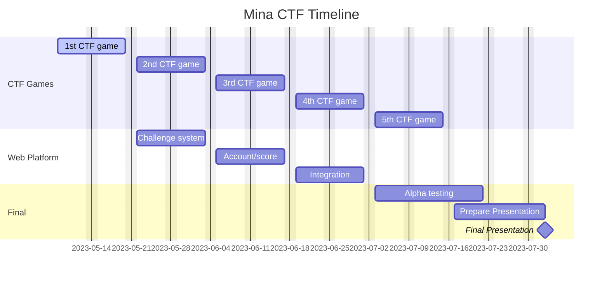

# MinaCTF

## Web Platform Design

- Database
  - UserChallengeTable
    - publicKey
    - challengeId
    - contractId (zkapp publicKey)
    - startTime
    - captureTime
    - score
- Backend
  - start a challenge: POST /api/:challenge
    - request: { payerPk: base58(string), auth: { pk: string, signature: {field: string, scalar: string}, message: string } }
    - response: { tx: object, contractId: base58(string) }
  - submit the flag: PUT /api/:challenge
    - request: { publicKey: string }
    - response: { success: boolean }
  - challenge status: GET /api/:publicKey
    - response: { publicKey: base58(string), challenges: { contractId: string, score: number, startTime: number, captureTime: number }[] }
  - scores: GET /api/score/list
    - response: { username: string, score: number }[]
- Frontend
  - Challenge
    - List
    - Guide page (include start and submit function)
  - Account
    - Login
  - Scoreboard
    - List

## TODOs

- [ ] Message signing when deploy need to check validity by time

## FAQ

### Is there a way to cache/skip compiling?

TLDR: No

REF:

- [• Discord | "Is it possible to precompile a zkApp on client side?" | Mina Protocol](https://discord.com/channels/484437221055922177/1070570936799084554)
- [• Discord | "is there a way to cache/skip compiling?" | Mina Protocol](https://discord.com/channels/484437221055922177/1105190653173960894/1105190653173960894)
- [• Discord | "Cache compiled zkApp?" | Mina Protocol](https://discord.com/channels/484437221055922177/1047570237366751345/1047570237366751345)
- [Restore prover keys · Issue #87 · o1-labs/snarkyjs](https://github.com/o1-labs/snarkyjs/issues/87)
- [Unable to verify proof, without running compile on any contract first · Issue #427 · o1-labs/snarkyjs](https://github.com/o1-labs/snarkyjs/issues/427)
