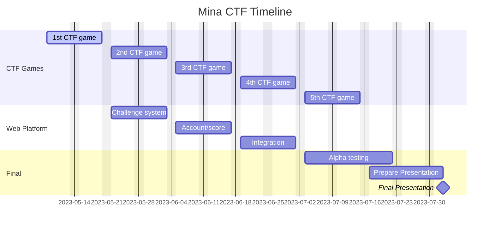

# MinaCTF

```mermaid
gantt
    dateFormat  YYYY-MM-DD
    title       Mina CTF Timeline
    excludes    weekends
    %% (`excludes` accepts specific dates in YYYY-MM-DD format, days of the week ("sunday") or "weekends", but not the word "weekdays".)

    section CTF Games
    1st CTF game : active, ctf1, 2023-05-08, 10d
    2nd CTF game : 10d
    3rd CTF game : 10d
    4th CTF game : 10d
    5th CTF game : 10d

    section Web Platform
    Challenge system : after ctf1, 2023-05-22, 10d
    Account/score: 10d
    Integration: 10d

    section Final
    Alpha testing : 2023-07-03, 15d
    Prepare Presentation              :2023-07-17, 12d
    Final Presentation               :milestone, 2023-08-02
```