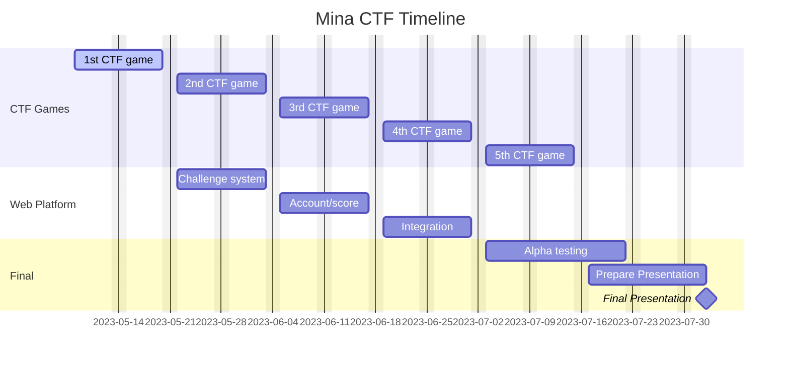

# MinaCTF

## Hints

Max Field Number is 
- Dec: 28,948,022,309,329,048,855,892,746,252,171,976,963,363,056,481,941,560,715,954,676,764,349,967,630,336
- Hex: 40000000000000000000000000000000224698FC094CF91B992D30ED00000000 (32 bytes)
- Bin: 100000000000000000000000000000000000000000000000000000000000000000000000000000000000000000000000000000000000000000000000000000000100010010001101001100011111100000010010100110011111001000110111001100100101101001100001110110100000000000000000000000000000000 (255 bits)
